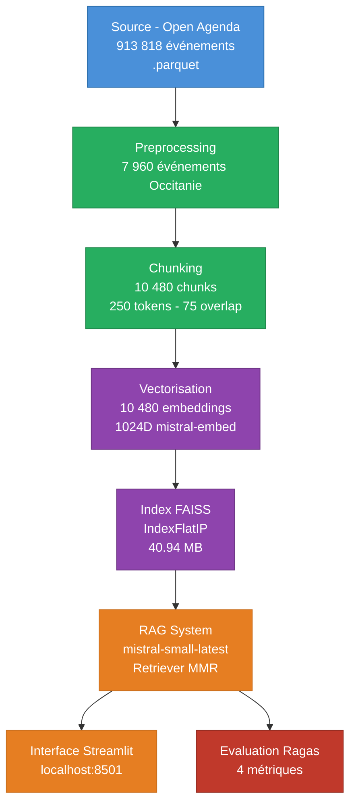

# Rapport Technique — P11 RAG Chatbot Puls-Events

**Projet :** Développement d'un assistant de recommandation d'événements culturels  
**Auteur :** Aymeric Bailleul  
**Date :** 19/02/2026  

---

## 1. Introduction et contexte

### 1.1 Contexte métier

Puls-Events est une plateforme de recommandation d'événements culturels souhaitant intégrer un assistant conversationnel capable de répondre aux questions des utilisateurs sur les événements disponibles. Face à un catalogue potentiellement vaste et hétérogène, la recherche par mots-clés classique montre ses limites : elle ne comprend pas l'intention de l'utilisateur et ne peut pas synthétiser plusieurs sources pour formuler une réponse cohérente.

Ce projet répond à une problématique concrète : **comment permettre à un utilisateur d'interroger en langage naturel une base d'événements culturels et obtenir une réponse précise, contextualisée et vérifiable ?**

### 1.2 Objectif du POC

Ce Proof of Concept démontre la faisabilité technique d'un assistant conversationnel basé sur une architecture RAG (Retrieval-Augmented Generation) appliquée aux données événementielles de la région Occitanie. Le périmètre volontairement restreint (une région, un snapshot temporel) permet de valider la chaîne technique complète avant un éventuel déploiement à plus grande échelle.

### 1.3 Données sources

Les données proviennent du jeu de données ouvert **Open Agenda** (opendatasoft.com), recensant les événements culturels publics en France. Le snapshot utilisé date du 03/02/2026 et contient 913 818 événements sur l'ensemble du territoire national.

---

## 2. Architecture du système RAG

### 2.1 Vue d'ensemble

Un système RAG (Retrieval-Augmented Generation) fonctionne en deux temps :

1. **Retrieval** : récupérer depuis une base vectorielle les passages les plus pertinents par rapport à la question posée
2. **Generation** : utiliser un LLM pour formuler une réponse en langage naturel, en se basant exclusivement sur les passages récupérés

Cette architecture résout le problème des hallucinations des LLM : le modèle ne génère pas de contenu de mémoire, il synthétise uniquement les informations qui lui sont fournies dans le contexte.

### 2.2 Pipeline complet



Le pipeline transforme **913 818 événements bruts** en un assistant conversationnel en 6 étapes :

1. **Filtrage** → 7 960 événements Occitanie (filtre géographique + temporel + nettoyage HTML)
2. **Chunking** → 10 480 segments de 250 tokens avec 30% de chevauchement
3. **Vectorisation** → 10 480 vecteurs 1024D via `mistral-embed`
4. **Indexation** → index FAISS exact (< 1ms/requête, 40.94 MB)
5. **RAG** → retriever MMR sélectionne 10 chunks diversifiés → `mistral-small-latest` génère une réponse ancrée dans le contexte
6. **Interface + Évaluation** → chat Streamlit + scoring Ragas sur 4 métriques

---

## 3. Choix techniques

### 3.1 Pourquoi FAISS ?

**FAISS** (Facebook AI Similarity Search) est la solution de référence pour la recherche vectorielle en mémoire. Pour ce POC, trois raisons ont motivé ce choix :

| Critère | FAISS | Alternative (Chroma, Weaviate...) |
|---|---|---|
| Déploiement | Aucun serveur requis, fichier .bin | Nécessite un service dédié |
| Performance | Recherche exacte en O(n) sur 10 480 vecteurs | Overkill pour < 100K vecteurs |
| Intégration LangChain | Natif `FAISS.load_local()` | Variable selon la solution |
| Coût | Gratuit, open-source | Parfois payant en cloud |

L'index choisi est **IndexFlatIP** (Inner Product) qui équivaut à la similarité cosinus sur des vecteurs L2-normalisés. Pour 10 480 vecteurs, la recherche exacte est suffisante (< 1ms par requête). Un index approximatif (IVF, HNSW) ne serait justifié qu'au-delà de quelques millions de vecteurs.

### 3.2 Pourquoi Mistral AI ?

Mistral AI a été choisi comme unique fournisseur pour trois raisons :

**a) Modèle d'embeddings (`mistral-embed`)**  
Produit des vecteurs 1024 dimensions optimisés pour les tâches de recherche sémantique. La cohérence entre le modèle d'embedding des données et celui des requêtes est garantie (même modèle). Les vecteurs sont déjà normalisés, ce qui simplifie le calcul de similarité.

**b) Modèle de génération (`mistral-small-latest`)**  
Modèle équilibré performance/coût. Avec `temperature=0.0`, les réponses sont déterministes et ancrées dans le contexte. `top_p=1.0` est obligatoire en mode greedy sampling.

**c) Modèle d'évaluation (`mistral-large-latest`)**  
Modèle premium utilisé comme juge Ragas. Sa supériorité en compréhension du français garantit une évaluation fiable des métriques.

Ce pattern **producteur léger / juge lourd** est une pratique standard : on optimise le coût de production en utilisant un modèle plus petit, et on réserve le modèle premium pour l'évaluation ponctuelle.

### 3.3 Pourquoi LangChain ?

LangChain fournit l'orchestration de la chaîne RAG en réduisant le code boilerplate. Il offre :

- **FAISS.load_local()** : chargement du vectorstore existant sans re-vectorisation
- **as_retriever()** : configuration MMR en une ligne
- **ChatPromptTemplate** : gestion structurée du prompt système + question
- **LCEL** (LangChain Expression Language) : composition de la chaîne `retriever | prompt | llm | parser` de façon lisible
- **LangChain-Mistralai** : intégration native `ChatMistralAI` et `MistralAIEmbeddings`

---

## 4. Méthodologie de pré-processing

### 4.1 Filtrage des données

Sur les 913 818 événements du dataset national :
- **Filtre géographique** : `location_region == "Occitanie"` → 89 491 événements
- **Filtre temporel** : événements des 365 derniers jours + tous les futurs → 7 960 événements
- **Nettoyage** : suppression des colonnes avec > 70% de valeurs manquantes, nettoyage HTML des descriptions longues

### 4.2 Construction du champ `text_for_rag`

Chaque événement est représenté par un champ texte composite structuré :

```
Titre: {title_fr} |
Description: {description_fr} |
Details: {longdescription_fr_clean} |
Mots-cles: {keywords_fr} |
Lieu: {location_city}
```

Ce format délimité par `|` permet au chunker de préserver le contexte sémantique et au LLM de distinguer les champs lors de la génération.

### 4.3 Stratégie de chunking

La stratégie de fenêtre glissante a été retenue avec les paramètres suivants :

| Paramètre | Valeur | Justification |
|---|---|---|
| Taille du chunk | 250 tokens | Assez court pour être précis, assez long pour être complet |
| Chevauchement | 75 tokens (30%) | Évite de couper des informations importantes en limite de chunk |
| Encodeur | cl100k_base | Compatible avec les modèles Mistral |
| Résultat | 10 480 chunks | Moyenne de 1.31 chunk/événement |

Chaque chunk conserve les métadonnées de l'événement parent : `uid`, `title_fr`, `firstdate_begin`, `location_city`, `location_region`, `chunk_index`.

---

## 5. Stratégie de vectorisation et indexation

### 5.1 Vectorisation

Le modèle `mistral-embed` produit des vecteurs de **1024 dimensions** qui encodent la sémantique du texte. Les vecteurs sont traités par batches de 100 avec un délai de 1 seconde entre chaque batch pour respecter le rate limit de l'API.

- Durée totale : ~4 minutes pour 10 480 chunks
- Fichier produit : `embeddings.npy` (83 MB)
- Les vecteurs sont normalisés (norme L2 = 1) avant l'indexation FAISS

### 5.2 Index FAISS

L'index `IndexFlatIP` calcule le produit scalaire entre le vecteur de requête et tous les vecteurs de la base. Sur des vecteurs normalisés, ce produit scalaire est équivalent à la similarité cosinus.

- Taille de l'index : 40.94 MB
- Temps de création : 0.39 secondes
- Temps de recherche : < 1ms par requête (10 480 vecteurs)

### 5.3 Retriever MMR (Maximal Marginal Relevance)

La recherche classique par similarité présente un défaut pour les événements chunké en plusieurs parties : elle peut retourner plusieurs chunks du même événement, apportant peu d'information supplémentaire.

**MMR** résout ce problème en équilibrant pertinence et diversité :

```
MMR(d) = λ · Sim(d, q) - (1-λ) · max Sim(d, d')
                                    d'∈S
```

Où :
- `Sim(d, q)` : similarité du document avec la requête
- `Sim(d, d')` : similarité avec les documents déjà sélectionnés
- `λ = 0.7` : 70% pertinence, 30% diversité

Configuration retenue : `fetch_k=20` candidats pré-sélectionnés, `k=10` retenus après diversification.

---

## 6. Résultats du POC

### 6.1 Métriques Ragas

L'évaluation a été conduite sur 5 questions représentatives de la zone Occitanie avec le framework **Ragas** et le juge `mistral-large-latest`.

| Métrique | Score | Interprétation |
|---|---|---|
| `faithfulness` | **0.764** | 76% des affirmations sont ancrées dans le contexte récupéré |
| `answer_relevancy` | **0.910** | Les réponses correspondent très bien aux questions posées |
| `context_precision` | **0.700** | 70% des chunks récupérés sont effectivement pertinents |
| `context_recall` | **0.583** | 58% des informations attendues sont bien récupérées |

### 6.2 Analyse par question

| Question | faithfulness | answer_relevancy | context_precision | context_recall |
|---|---|---|---|---|
| Expositions à Montpellier ? | 0.429 | 0.895 | **1.000** | 0.250 |
| Spectacles enfants Occitanie ? | 0.813 | 0.911 | **1.000** | 0.333 |
| Festivals musique été Occitanie | 0.857 | 0.921 | 0.000 | 1.000 |
| Carcassonne ce weekend ? | 0.870 | 0.922 | **1.000** | 0.667 |
| Événements plein air Occitanie | 0.852 | 0.903 | 0.500 | 0.667 |

**Observations :**  
- La `answer_relevancy` est uniformément élevée (> 0.89) : le LLM formule des réponses bien adaptées aux questions.
- La `context_precision` est excellente pour les questions localisées (Montpellier, Carcassonne) mais chute à 0 pour la question "Festivals musique été" — le MMR a favorisé la diversité au détriment de l'ordre de pertinence pour cette requête générique.
- Le `context_recall` est le point d'amélioration principal : certaines informations pertinentes ne sont pas dans les 10 chunks récupérés.

### 6.3 Exemples de réponses

**Question :** *"Y a-t-il des expositions à Montpellier ?"*

> "Oui, il y a plusieurs expositions à Montpellier. L'exposition *Montpellier, regarder la ville autrement* sur l'architecture est accessible le 20 septembre 2025 en visite libre toute la journée. L'exposition *L'Europe et son patrimoine* présente le label du patrimoine européen, également le 20 septembre 2025. L'exposition *Regards sur l'opéra* présente une cinquantaine de dessins d'étudiants de LISAA Architecture Montpellier depuis le 10 mai 2025 dans le Grand Foyer de l'Opéra Comédie."

**Question hors périmètre :** *"Concerts à Paris ?"*

> "Je n'ai pas d'informations sur des concerts à Paris dans ma base de données. Mon périmètre est limité aux événements de la région Occitanie."

---

## 7. Conclusion

Ce POC démontre la faisabilité technique d'un assistant RAG appliqué aux événements culturels. La chaîne complète — de la collecte Open Agenda à l'interface Streamlit en passant par la vectorisation FAISS et la génération Mistral — est fonctionnelle et évaluée quantitativement.

Les scores Ragas obtenus (`faithfulness=0.764`, `answer_relevancy=0.910`) valident la qualité des réponses générées. Le principal axe d'amélioration identifié est le `context_recall` (0.583), qui pourrait être amélioré par une augmentation de k et l'ajout de filtres metadata.

La stack technique retenue — **LangChain + FAISS + Mistral AI** — est pragmatique, sans infrastructure serveur supplémentaire et facilement reproductible, ce qui en fait une base solide pour un déploiement progressif.

---