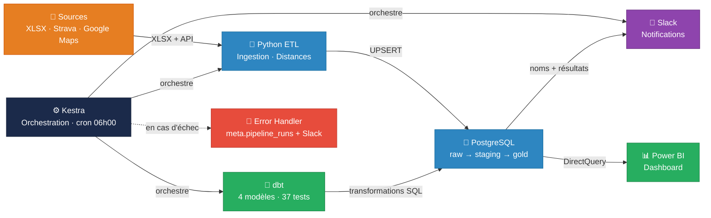
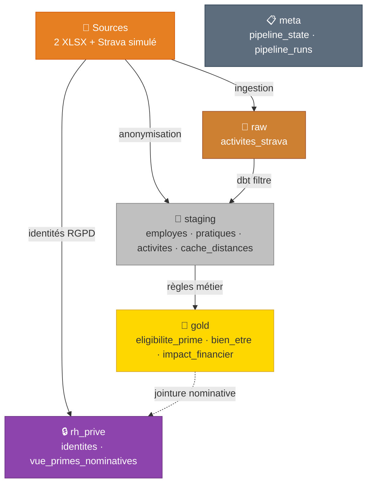
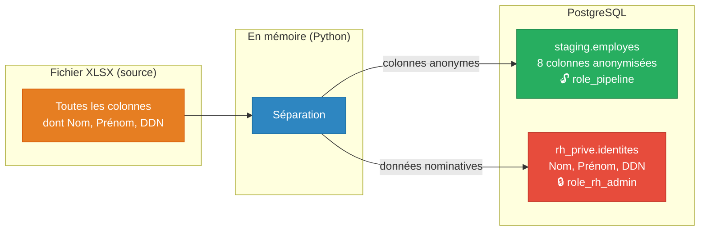
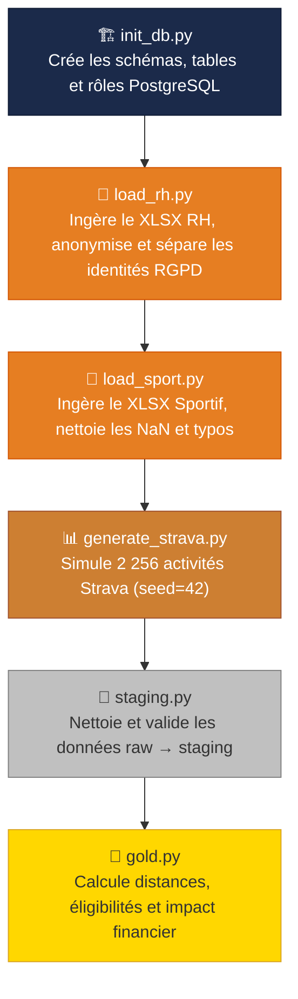
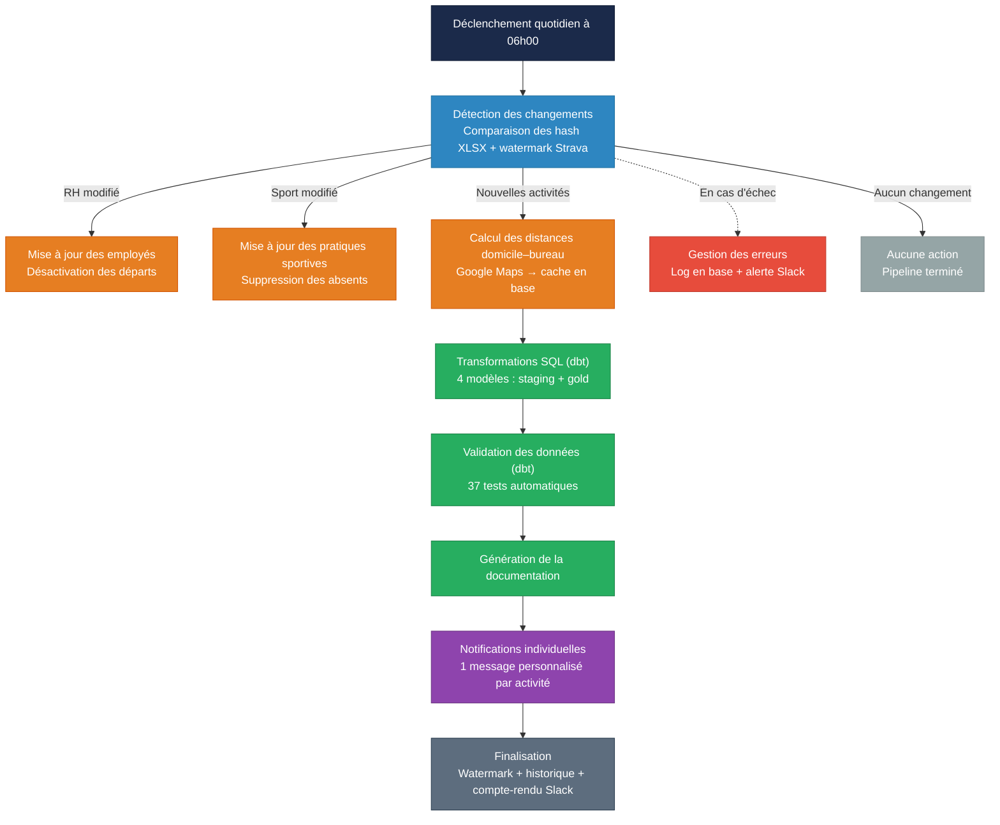
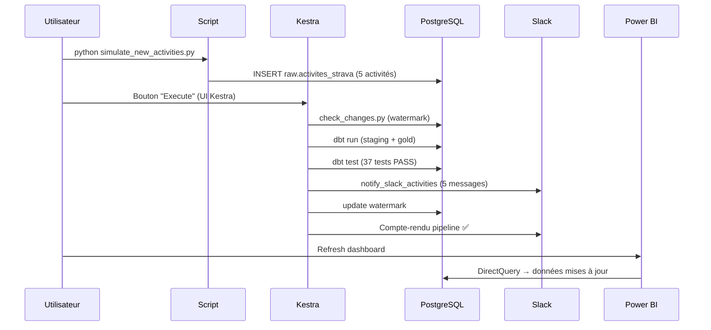

# Sport Data Solution — POC Avantages Sportifs

## Trame de présentation

**Auteur :** Aymeric Bailleul  
**Formation :** Data Engineer – OpenClassrooms  
**Projet :** P12 – Gérez un projet d'infrastructure  
**Date :** Mars 2026

---

## Slide 1 – Page de titre

**Sport Data Solution — POC Avantages Sportifs**

- Pipeline de données de bout en bout
- Aymeric Bailleul — Data Engineer
- Mars 2026

---

## Slide 2 – Sommaire

1. Contexte et objectifs
2. Données sources
3. Règles métier
4. Architecture technique
5. Infrastructure de données (PostgreSQL)
6. Privacy by Design (RGPD)
7. Pipeline ETL (Python + dbt)
8. Orchestration (Kestra)
9. Tests de qualité
10. Notifications Slack
11. Dashboard Power BI
12. Démonstration live
13. Résultats clés
14. Perspectives

---

## Slide 3 – Contexte et objectifs

**L'entreprise :** Sport Data Solution — startup de monitoring sportif (Alexandre + Juliette)

**La mission :** Juliette souhaite récompenser les salariés sportifs avec :
- **Prime sportive** : 5 % du salaire brut pour les trajets domicile-bureau sportifs
- **5 journées bien-être** : pour les salariés ayant ≥ 15 activités physiques / an

**Objectifs du POC :**
- Tester la faisabilité technique
- Déterminer les données à collecter
- Calculer l'impact financier pour l'entreprise

---

## Slide 4 – Données sources

### Données RH (`Données+RH.xlsx`)
- 161 salariés
- 11 colonnes : ID, Nom, Prénom, DDN, BU, Date embauche, Salaire brut, Type contrat, CP, Adresse, Mode déplacement

### Données sportives (`Données+Sportive.xlsx`)
- 161 lignes — 2 colonnes : ID salarié, Pratique d'un sport
- 66 NaN (41 %) → « Non déclaré », typo « Runing » → « Running »

### Données Strava (simulées)
- 2 256 activités générées sur 12 mois
- 95 salariés sportifs, 15 types de sports
- Seed reproductible (seed=42)

---

## Slide 5 – Règles métier

### Prime sportive (5 % salaire brut)

| Mode de déplacement | Distance max domicile–bureau |
|---|---|
| Marche / Running | ≤ 15 km |
| Vélo / Trottinette / Autres | ≤ 25 km |

- Distance réelle calculée via **Google Maps API** (fallback haversine)
- Adresse entreprise : 1362 Av. des Platanes, 34970 Lattes

### 5 journées bien-être
- Seuil : ≥ 15 activités physiques dans l'année
- Source : activités Strava (simulées pour le POC)

---

## Slide 6 – Architecture technique — Vue d'ensemble

**Stack technique :**

| Composant | Outil |
|---|---|
| Base de données | PostgreSQL 16 (Docker) |
| ETL / Ingestion | Python 3.12 (pandas, psycopg2) |
| Transformations SQL | dbt (staging + gold) |
| Orchestration | Kestra (UI web, cron, logs) |
| Distances | Google Maps API + fallback haversine |
| Tests | pytest (51 tests) + dbt tests (37 tests) |
| Notifications | Slack Webhooks HTTP |
| Visualisation | Power BI (DirectQuery) |

---

## Slide 7 – Infrastructure de données — Schéma Medallion

- **5 schémas** : raw, staging, gold, rh_prive, meta
- **10 tables** + 1 vue
- Architecture Medallion adaptée au RGPD

---

## Slide 8 – Privacy by Design (RGPD)

**Principe :** Ne stocker que le strict nécessaire, et séparer les données personnelles dès l'ingestion pour que seuls les profils autorisés y accèdent.

**3 rôles PostgreSQL :**

| Rôle | Accès | Usage |
|---|---|---|
| `role_pipeline` | raw + staging + gold (R/W) | Pipeline ETL |
| `role_analytics` | gold (lecture seule) | Power BI |
| `role_rh_admin` | hérite pipeline + rh_prive | Slack nominatif |

---

## Slide 9 – Pipeline ETL

**Points clés :**
- UPSERT + soft-delete (actif = FALSE) pour l'idempotence
- Hash SHA-256 des fichiers sources pour la détection de changements
- Watermark Strava pour le traitement incrémental
- Cache distances en base (évite les appels API redondants)

---

## Slide 10 – dbt — Transformations SQL

**4 modèles dbt :**

| Modèle | Schéma | Description |
|---|---|---|
| `stg_activites_strava` | staging | Filtre types invalides, salariés inactifs, dates hors période |
| `eligibilite_prime` | gold | Croise employes × distances × seuils |
| `eligibilite_bien_etre` | gold | Compte activités ≥ 15 → 5 jours |
| `impact_financier` | gold | Agrégation par département |

**37 tests dbt :**
- not_null, unique, accepted_values (15 sports)
- Couverture des 4 modèles

**Documentation :** `dbt docs generate` → http://localhost:4080

---

## Slide 11 – Orchestration Kestra

**5 services Docker :**
- PostgreSQL (port 5433)
- Kestra (port 9000) — orchestrateur
- kestra-setup — import automatique du flow
- dbt-docs (port 4080) — documentation nginx
- dbt-docs-perms — permissions volume

---

## Slide 12 – Tests de qualité

### pytest — 51 tests

| Module | Tests | Couverture |
|---|---|---|
| `test_distances.py` | 10 | Haversine, seuils, éligibilité, adresse invalide |
| `test_simulation.py` | 9 | Distances, durées, dates, IDs, sports, volumes |
| `test_staging.py` | 12 | Doublons, salaires, dates, complétude, pratiques |
| `test_gold.py` | 9 | Primes 5 %, bien-être ≥ 15, impact financier |
| `test_rh_prive.py` | 9 | Identités RGPD, FK, Privacy by Design, droits |
| **conftest.py** | 2 fixtures | Connexion DB session-scoped |

### dbt — 37 tests
- not_null, unique sur les clés primaires
- accepted_values sur type_sport (15 valeurs)

---

## Slide 13 – Notifications Slack

**Deux canaux Slack :**

| Canal | Webhook | Contenu |
|---|---|---|
| Messages activités | `SLACK_WEBHOOK` | 1 message personnalisé par activité |
| Infos pipeline | `SLACK_WEBHOOK_INFO` | Compte-rendu d'exécution |

**Exemples de messages :**
> « Bravo Juliette ! Tu viens de courir 10.8 km en 46 min ! Quelle énergie ! »

> « Magnifique Laurence ! Une randonnée de 10 km terminée ! »

- 15 sports × 2-3 templates = ~35 messages distincts
- Message aléatoire pour chaque activité (variété)
- Prénoms/noms réels via `rh_prive.identites`

---

## Slide 14 – Dashboard Power BI

Le dashboard Power BI est le livrable final destiné aux décideurs. Il se connecte directement à PostgreSQL en **DirectQuery** (port 5433, `role_analytics`), ce qui garantit des données toujours à jour sans import manuel ni fichier intermédiaire.

Le dashboard est organisé en **deux pages**, séparant les indicateurs publics des données RH sensibles.

### KPIs publics (page 1) — Vue d'ensemble de l'activité sportive
- Camembert sportifs / non-sportifs (59 % / 41 %)
- Top 10 sports déclarés (histogramme)
- Top 5 sportifs (classement par nb activités)
- Carte géographique des salariés par département
- Taux de participation sur les 3 derniers mois

### KPIs RH (page 2) — Impact financier et éligibilités
- Histogramme des types de mobilité domicile–bureau
- Table distances + temps de trajet estimé par salarié
- Total jours bien-être accordés (335 jours)
- Nombre de salariés éligibles bien-être (67)
- Prime moyenne par salarié éligible
- Total des primes sportives (172 482,50 EUR)

**Point technique :** La page publique utilise `role_analytics` (schéma `gold` en lecture seule, données anonymes). La page RH, qui affiche les noms des salariés, utilise `role_rh_admin` avec accès à la vue `rh_prive.vue_primes_nominatives` — conformément au principe RGPD de moindre privilège, seuls les profils RH habilités accèdent aux données nominatives.

---

## Slide 15 – Démonstration live

### Scénario de démonstration

**Étapes :**
1. Vérifier l'état initial (requête SQL)
2. Simuler 5 nouvelles activités Strava
3. Exécuter le flow dans Kestra (UI)
4. Observer les logs en temps réel
5. Vérifier les messages Slack
6. Rafraîchir Power BI → données à jour

---

## Slide 16 – Résultats clés

| Indicateur | Valeur |
|---|---|
| Salariés | 161 |
| Activités Strava simulées | 2 256 |
| Éligibles prime sportive | 68 |
| Total primes | 172 482,50 EUR |
| Éligibles bien-être | 67 |
| Total jours bien-être | 335 jours |
| Départements couverts | 5 |
| Tests pytest | 51 / 51 PASS |
| Tests dbt | 37 / 37 PASS |
| Adresses calculées (Google Maps) | 159 |

---

## Slide 17 – Choix techniques justifiés

| Choix | Justification |
|---|---|
| PostgreSQL via Docker | Simule un environnement de production réaliste |
| Rôles PostgreSQL (3) | Principe du moindre privilège, conformité RGPD |
| Google Maps API + haversine | Distances routières réelles, fallback robuste |
| Slack Webhooks réels | Exigence de la note de cadrage (publications automatiques) |
| pytest + dbt tests | Double couverture : Python (51) + SQL (37) |
| dbt (staging + gold) | Transformations versionnées, testées, documentées |
| Kestra | Orchestration visuelle, logs, historique, cron |
| Power BI DirectQuery | Données toujours à jour, pas d'import manuel |
| UPSERT + soft-delete | Idempotence, gestion des départs sans perte d'historique |
| SHA-256 + watermark | Détection intelligente des changements (évite les re-traitements inutiles) |

---

## Slide 18 – Perspectives

- **Connexion Strava réelle** : remplacer la simulation par l'API OAuth2 Strava
- **Scaling** : passage à un cluster PostgreSQL ou migration cloud (AWS RDS)
- **Alerting avancé** : seuils d'alerte sur les anomalies de déclaration
- **Paramétrage dynamique** : taux de prime et seuils modifiables sans redéploiement
- **Intégration CI/CD** : tests automatisés à chaque push GitHub
- **Extension du dashboard** : vue manager par département, évolution temporelle

---

## Slide 19 – Conclusion

Ce POC démontre qu'il est possible de construire un pipeline de données complet, de l'ingestion à la restitution, en respectant les contraintes RGPD dès la conception.

**Ce qui a été livré :**
- Un pipeline automatisé de bout en bout : ingestion, transformation, orchestration, notification, visualisation
- Une architecture Medallion avec séparation stricte des données personnelles (Privacy by Design)
- Une couverture de tests exhaustive (88 tests : 51 pytest + 37 dbt) garantissant la fiabilité des résultats
- Un dashboard Power BI en temps réel pour les décideurs

**Ce que le POC a permis de valider :**
- La faisabilité technique du calcul des primes sportives et des journées bien-être
- L'impact financier chiffré : **172 482,50 EUR** de primes pour **68 salariés éligibles**
- La capacité à orchestrer l'ensemble avec Kestra de manière idempotente et traçable

**En un mot :** le POC est opérationnel et prêt à évoluer vers une connexion Strava réelle et un déploiement cloud.

---

## Slide 20 – Merci

**Sport Data Solution — POC Avantages Sportifs**

Aymeric Bailleul — Data Engineer

📧 aymericbailleul@gmail.com  
🔗 GitHub : repo sur branche `En-cours`

**Questions ?**
