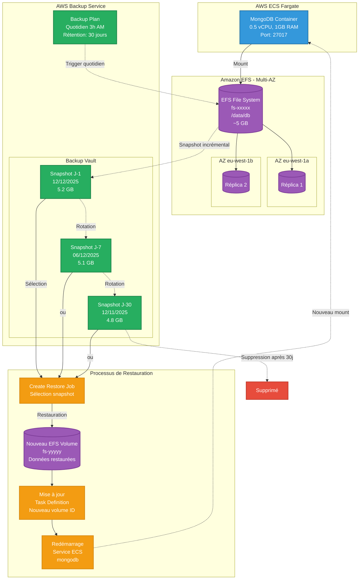

## 📋 Configuration AWS Backup

**Création du plan de backup:**
```bash
# backup-plan.json
{
  "BackupPlanName": "mongodb-efs-daily-backup",
  "Rules": [{
    "RuleName": "DailyBackup3AM",
    "TargetBackupVaultName": "Default",
    "ScheduleExpression": "cron(0 3 * * ? *)",
    "StartWindowMinutes": 60,
    "CompletionWindowMinutes": 120,
    "Lifecycle": {
      "DeleteAfterDays": 30
    }
  }]
}

# Créer le plan
aws backup create-backup-plan --backup-plan file://backup-plan.json
```

**Assignation du file system EFS:**
```bash
# selection.json
{
  "SelectionName": "mongodb-efs-selection",
  "IamRoleArn": "arn:aws:iam::343374742393:role/AWSBackupDefaultServiceRole",
  "Resources": [
    "arn:aws:elasticfilesystem:eu-west-1:343374742393:file-system/fs-xxxxx"
  ]
}

# Assigner
aws backup create-backup-selection \
  --backup-plan-id <plan-id> \
  --backup-selection file://selection.json
```

## 🔄 Processus de restauration

**1. Lister les snapshots disponibles:**
```bash
aws backup list-recovery-points-by-backup-vault \
  --backup-vault-name Default \
  --by-resource-arn "arn:aws:elasticfilesystem:eu-west-1:343374742393:file-system/fs-xxxxx"
```

**2. Créer un job de restauration:**
```bash
aws backup start-restore-job \
  --recovery-point-arn <recovery-point-arn> \
  --metadata file-system-id=fs-new,Encrypted=false \
  --iam-role-arn arn:aws:iam::343374742393:role/AWSBackupDefaultServiceRole
```

**3. Mettre à jour la Task Definition ECS:**
```json
{
  "volumes": [{
    "name": "efs-mongodb",
    "efsVolumeConfiguration": {
      "fileSystemId": "fs-new",  // ← Nouveau file system restauré
      "transitEncryption": "ENABLED"
    }
  }]
}
```

**4. Redémarrer le service:**
```bash
aws ecs update-service \
  --cluster weather-pipeline-cluster \
  --service mongodb \
  --force-new-deployment
```

## 💰 Coût

| Ressource | Taille | Coût/mois |
|-----------|--------|-----------|
| EFS Storage | ~5 GB | ~1.50$ |
| EFS Backup Storage | ~5 GB × 30 jours | ~0.30$ |
| **TOTAL** | - | **~1.80$/mois** |

**RTO (Recovery Time Objective)**: ~10-15 minutes  
**RPO (Recovery Point Objective)**: 24 heures (backup quotidien)
