```mermaid
flowchart LR
    Start([DÉBUT]):::startEnd
    
    %% Flux principal simplifié
    Start --> Sources[Sources:<br/>InfoClimat API<br/>WU Excel]:::data
    Sources --> Airbyte[Airbyte]:::process
    Airbyte --> S3Raw[(S3<br/>raw)]:::storage
    S3Raw --> ETL[ETL<br/>Python]:::process
    ETL --> Valid{Valid?}:::decision
    Valid -->|Non| Err1[Erreur]:::error
    Valid -->|Oui| S3Clean[(S3<br/>cleaned)]:::storage
    S3Clean --> Watch[Watch<br/>5min]:::process
    Watch --> New{New?}:::decision
    New -->|Non| Watch
    New -->|Oui| Tests[Tests<br/>Mongo]:::process
    Tests --> TestOK{OK?}:::decision
    TestOK -->|Non| Err2[Erreur]:::error
    TestOK -->|Oui| Import[Import<br/>Upsert]:::process
    Import --> MongoDB[(MongoDB<br/>4,950)]:::storage
    MongoDB --> End([FIN]):::startEnd
    S3Clean --> Cleanup[Cleanup<br/>1h]:::process
    Cleanup --> S3Arch[(S3<br/>archive)]:::storage
    
    %% Styles
    classDef startEnd fill:#27AE60,stroke:#1E8449,stroke-width:3px,color:#fff
    classDef process fill:#3498DB,stroke:#2874A6,stroke-width:2px,color:#fff
    classDef decision fill:#F39C12,stroke:#D68910,stroke-width:2px,color:#fff
    classDef storage fill:#9B59B6,stroke:#7D3C98,stroke-width:2px,color:#fff
    classDef error fill:#E74C3C,stroke:#C0392B,stroke-width:2px,color:#fff
    classDef monitor fill:#95A5A6,stroke:#7F8C8D,stroke-width:2px,color:#fff
    classDef info fill:#ECF0F1,stroke:#BDC3C7,stroke-width:1px,color:#2C3E50
```

## Informations complémentaires

**Fréquences d'exécution:**
- Airbyte: Manuel ou planifié
- ETL Watch: 1 heure (WATCH_INTERVAL=3600s)
- Import Watch: 5 minutes (WATCH_INTERVAL=300s)
- Cleanup Watch: 1 heure (CLEANUP_INTERVAL=3600s)

**Services ECS Fargate:**
- `mongodb` (0.5 vCPU, 1GB) - Actif 24/7
- `mongo-express` (0.25 vCPU, 0.5GB) - Actif 24/7
- `weather-etl` (0.5 vCPU, 1GB) - Manuel (desiredCount: 0)
- `mongodb-importer` (0.25 vCPU, 0.5GB) - Manuel (desiredCount: 0)
- `s3-cleanup` (0.25 vCPU, 0.5GB) - Manuel (desiredCount: 0)

**Résultats:**
- 4,950 mesures importées
- 6 stations météo
- 0% taux d'erreur
- 100% import réussi
