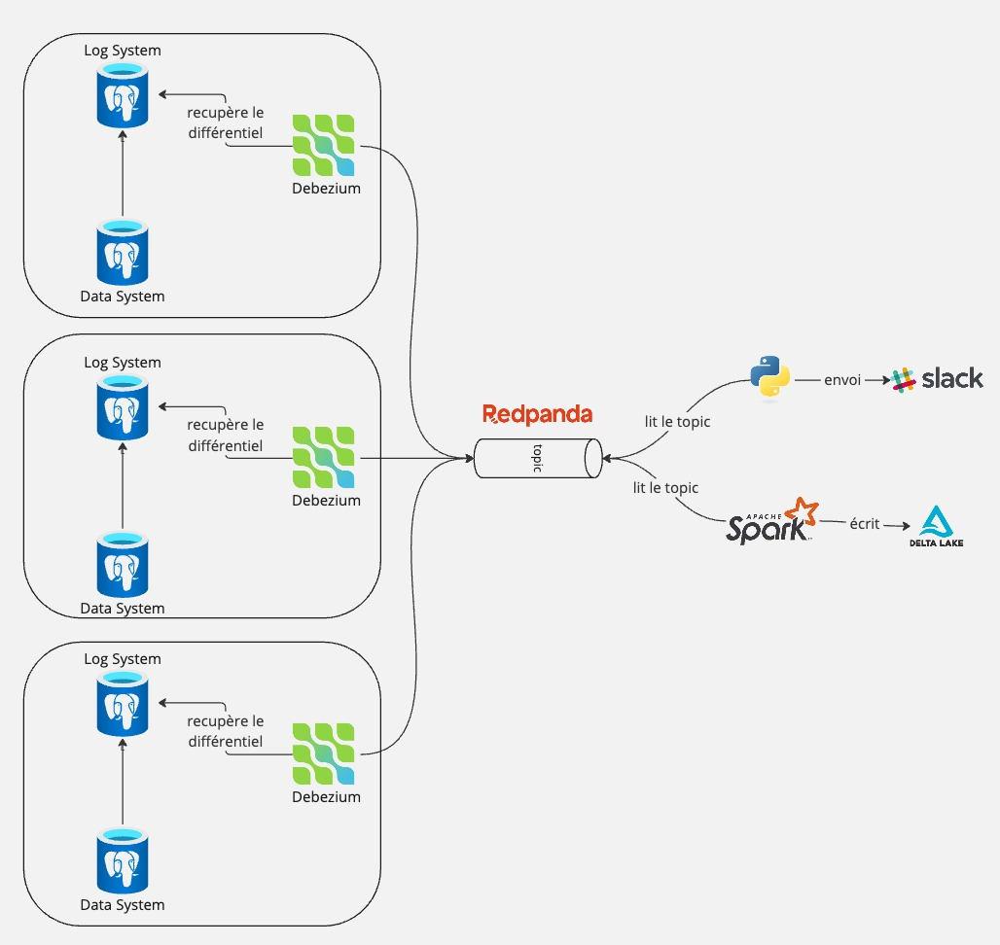
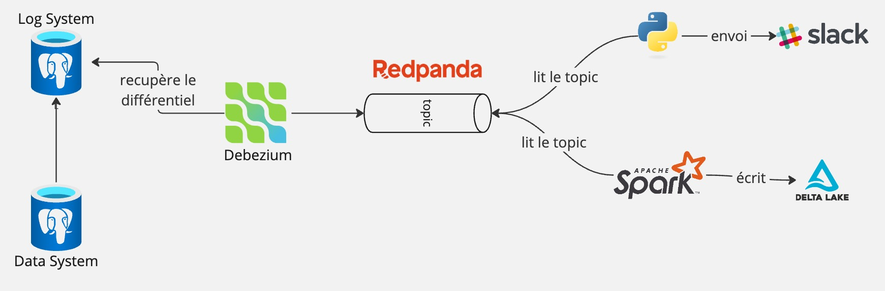
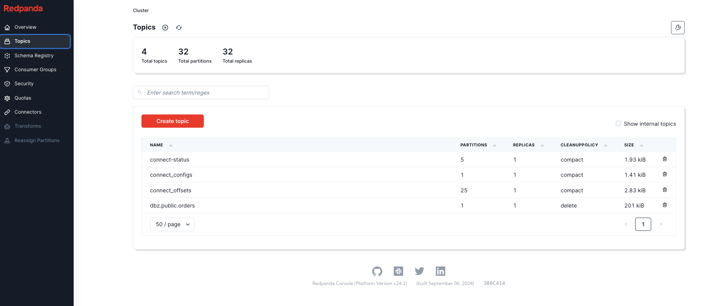
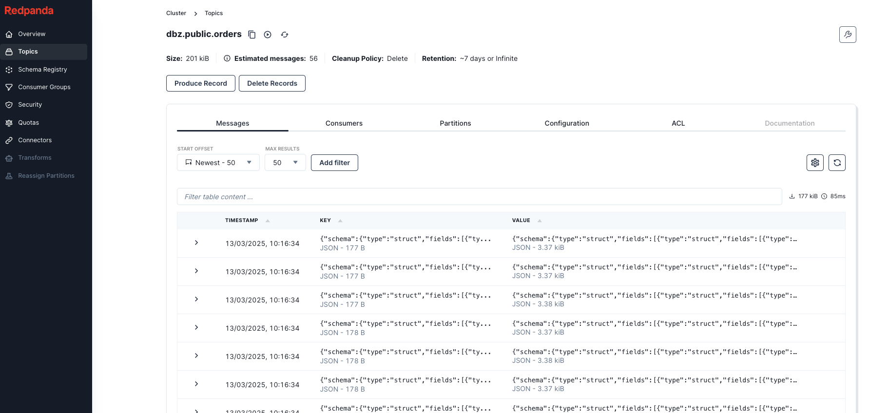
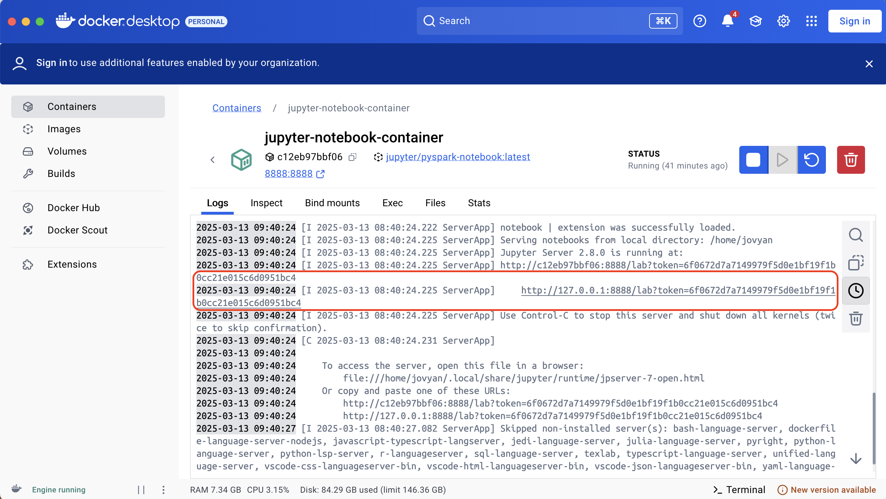
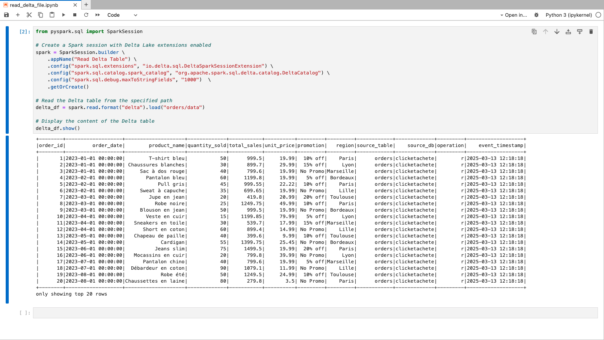

# Pipeline CDC temps réel avec Redpanda, Debezium, PostgreSQL, Spark et Python

Ce lab vous montre comment mettre en place un pipeline complet d'intégration de données en temps réel avec Redpanda, PostgreSQL, Debezium, Spark Streaming (Delta) et Python.

Dans ce cas pratique, vous simulerez un scénario concret inspiré de Click&Collect, une entreprise internationale d'e-commerce ayant des besoins critiques :

- Suivi des commandes en temps réel : Un script Python indépendant se connectera directement à Redpanda, récupérera les événements dès qu'une nouvelle commande sera créée, et déclenchera immédiatement une alerte (simulation d'un envoi vers Slack). Ce mécanisme garantit une réponse instantanée pour optimiser la logistique.
- Détection des fraudes et personnalisation des recommandations : Spark Streaming consommera les événements envoyés par Redpanda, appliquera des transformations adaptées et sauvegardera ces données dans un format optimisé (Delta). Ce stockage facilitera par la suite les analyses avancées nécessaires pour identifier des comportements frauduleux et améliorer les recommandations clients.




Pour simplifier l'exercice, vous allez utiliser une seule base de données PostgreSQL. Cependant, cette même configuration pourra facilement évoluer pour gérer toutes les bases PostgreSQL de Click&Collect, en tenant compte de la multiplicité des sources.



## 📌 Prerequisites

- Docker et Docker Compose installés.
- Git installé.


## 🚀 Lancer le lab

1. Clonez ce dépôt :

```shell
git clone https://github.com/redpanda-data/redpanda-labs.git
```

2. Définissez la version de Redpanda que vous souhaitez utiliser (consultez les versions disponibles sur [GitHub](https://github.com/redpanda-data/redpanda/releases)).

```shell
export REDPANDA_VERSION=24.2.7
```

3. Définissez la version de Redpanda Console (voir les versions disponibles sur [GitHub](https://github.com/redpanda-data/console)).

```shell
export REDPANDA_CONSOLE_VERSION=2.7.2
```

4. Démarrez l'environnement Docker :

```
docker compose up -d
```

Le conteneur PostgreSQL initialisera automatiquement la base clicketachete et la table `orders` via le script `postgres_bootstrap.sql`.

## ✅ Check PostgreSQL and Debezium CDC

5. Connectez-vous à PostgreSQL :

```shell
docker compose exec postgres psql -U postgresuser -d clicketachete
```

6. Vérifiez le contenu de la table `orders` :

```sql
select * from orders;
```

7. Configurez Debezium pour capturer les changements depuis PostgreSQL. Lancez la commande suivante pendant que Debezium est actif :

```shell
docker compose exec debezium curl -H 'Content-Type: application/json' debezium:8083/connectors --data '
{
  "name": "postgres-connector",
  "config": {
    "connector.class": "io.debezium.connector.postgresql.PostgresConnector",
    "plugin.name": "pgoutput",
    "database.hostname": "postgres",
    "database.port": "5432",
    "database.user": "postgresuser",
    "database.password": "postgrespw",
    "database.dbname" : "clicketachete",
    "database.server.name": "postgres",
    "table.include.list": "public.orders",
    "topic.prefix" : "dbz"
  }
}'
```
Patientez quelques instants pour permettre à Debezium de générer le snapshot initial dans Redpanda.

## ✅ Vérifiez les données dans Redpanda

8. Vérifiez que les topics Debezium sont créés dans Redpanda Console :

- Allez dans le console Redpanda ((http://localhost:8080/) et vérifiez que le topic `dbz.public.orders` a été créé :



Vous devriez voir toutes les lignes envoyées au topic :




- Vous pouvez égalemenet utiliser directement rpk pour vérifier :
```shel
docker compose exec redpanda rpk topic list
```

Résultat attendu :

| NAME    | PARTITIONS | REPLICAS |
| -------- | ------- | ------- |
| connect-status   | 5 | 1 |
| connect_configs  | 1 | 1 |
| connect_offsets  | 25 | 1 |
| dbz.public.orders  | 1 | 1 |

## 🔥 Traitement des données avec Spark Streaming

9. Lancez le Jupyter Notebook :

Consultez les logs du conteneur Jupyter (`jupyter-notebook-container`) pour obtenir l'URL d'accès :

```
http://127.0.0.1:8888/?token=your_token_here
````



Connectez-vous à l'interface:


10. Lancez le script Spark de streaming :

Depuis votre notebook (`ingest_job.ipynb`), exécutez le script Spark fourni. Celui-ci permet de :

- Consommer les données temps réel depuis le topic Redpanda (dbz.public.orders).
- Appliquer un schéma prédéfini pour parser les données JSON reçues.
- Sauvegarder les données traitées dans une table au format Delta.

11. Vérifiez les données sauvegardées dans la table Delta :

Ouvrez un autre notebook et lisez les données sauvegardées dans la table Delta (read_delta_file.ipynb) :



## 🐍 Python Consumer Job (Alertes simulées)

Pour illustrer l’envoi de notifications en temps réel (simulant des alertes Slack), vous allez lancer un consumer Python dédié qui :

- Lit les événements directement depuis Redpanda.
- Extrait les informations importantes des commandes.
- Simule l’envoi d’alertes en affichant des messages formatés dans les logs du conteneur.

### Option 1 : Exécution via Docker

12. Construisez l'image Docker depuis le script Python (consumer.py) :

```shell
docker build -t python-consumer ./python_consumer
```

13. Lancez le consumer Python après avoir démarré l’environnement principal :
```shell
docker run -d --network redpanda-cdc-postgres_redpanda_network --name python-consumer python-consumer
```
Cette commande lance le consumer Python en arrière-plan.

14. Vérifiez les messages traités :

Consultez les logs du container Python pour voir les alertes simulées en temps réel :

```shell
docker logs python-consumer
```

### Option 2: Exécution du script Python en local (sans Docker)

Si vous préférez exécuter le consumer Python directement depuis votre machine locale, suivez ces étapes :

12. Créez un environnement virtuel Python :
```shell
python3 -m venv venv
source venv/bin/activate
```

13. Installez les dépendances nécessaires :
```shell
pip install kafka-python
````

14. Lancez le script consumer.py :
```shell
python consumer_local.py
````


## 🧪 Testez le pipeline en temps réel (bout-en-bout)

15. Pendant que le consumer est actif, ouvrez un autre terminal et connectez-vous à PostgreSQL :

```shell
export REDPANDA_VERSION=24.2.7
export REDPANDA_CONSOLE_VERSION=2.7.2
docker compose exec postgres psql -U postgresuser -d clicketachete
```

16. Insérez un nouvel enregistrement :

```sql
INSERT INTO orders (order_date, product_name, quantity_sold, total_sales, promotion, region, unit_price) VALUES ('2024-01-01', 'T-shirt bleu', 50, 999.50, '10% off', 'Paris', 19.99);
```

Observez en temps réel les messages produits et consommés dans votre pipeline via Spark et Python.

## 🎯 Conclusion

En suivant ces étapes, vous aurez mis en place un pipeline complet de capture et traitement temps réel de données (CDC), qui :

- Capture les modifications PostgreSQL via Debezium et Redpanda.
- Traite ces données en temps réel avec Spark Streaming.
Stocke les données transformées dans une table Delta pour analyses ultérieures.
- Lance un job Python indépendant qui simule l’envoi de notifications temps réel vers des applications tierces.