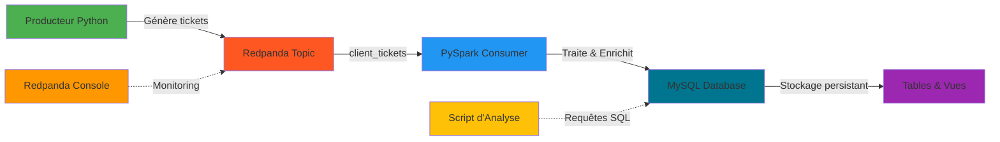
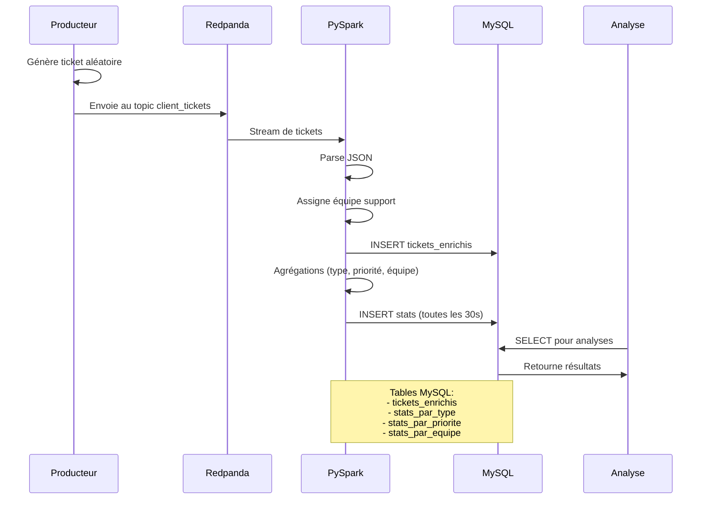

# Exercice 2 - Système de Gestion de Tickets Clients avec Redpanda, PySpark et MySQL

## Description du Projet

Ce projet implémente un **POC (Proof Of Concept)** de système de gestion de tickets clients en temps réel pour l'entreprise InduTech. Le pipeline ingère les tickets depuis Redpanda, les traite avec PySpark et les stocke dans MySQL pour analyse et reporting.

## Architecture du Pipeline

Visuel du schéma dans le dossier **/schemas**



### Flux de Données Détaillé

Visuel du schéma dans le dossier **/schemas**



## Structure des Données

### Ticket Client (Format JSON)

```json
{
  "ticket_id": "a1b2c3d4-5678-90ab-cdef-1234567890ab",
  "client_id": "CLI-1234",
  "date_creation": "2026-01-07T14:30:00",
  "demande": "Impossible de se connecter à mon compte",
  "type_demande": "Technique",
  "priorite": "Haute"
}
```

### Types de Demandes et Équipes Assignées

| Type de Demande | Équipe Assignée |
|----------------|-----------------|
| Technique | Equipe Support Technique |
| Facturation | Equipe Comptabilité |
| Commercial | Equipe Commerciale |
| Support | Equipe Assistance Client |
| Réclamation | Equipe Qualité |

### Priorités

- **Basse** : Demande standard
- **Moyenne** : Nécessite attention
- **Haute** : Urgent
- **Critique** : Priorité absolue

## Structure du Projet

```
exo2/
├── docker-compose.yml          # Orchestration des conteneurs
├── producer/                   # Service producteur de tickets
│   ├── Dockerfile
│   ├── producer.py
│   └── requirements.txt
├── schemas                     # Visuel des différents schémas
│   ├── architecture_pipeline.png
│   └── flux_donnees_detaille.png
├── consumer_pyspark/           # Service de traitement PySpark
│   ├── Dockerfile
│   ├── consumer.py
│   └── requirements.txt
├── mysql/                      # Configuration MySQL
│   ├── Dockerfile              # Image MySQL personnalisée
│   └── init.sql                # Script d'initialisation (tables + vues)
├── tests/                      # Scripts d'analyse et tests
│   ├── test_pipeline.py        # Tests automatisés pytest (24 tests)
│   ├── analyses_report.py      # Rapport d'analyse visuel
│   ├── requirements.txt        # Dépendances (pytest, pandas, mysql-connector)
│   └── README.md               # Documentation des analyses
├── output/                     # [Obsolète - conservé pour historique]
└── README.md                   # Cette documentation
```

## Installation et Lancement

### Prérequis

- Docker Desktop installé et démarré
- Docker Compose v2.x ou supérieur
- 4 GB RAM minimum disponible
- Python 3.8+ (pour le script d'analyse)
- Ports disponibles : 
  - **9092** : Redpanda (accès externe)
  - **29092** : Redpanda (accès inter-conteneurs)
  - **8080** : Redpanda Console (interface web)
  - **9644** : Redpanda Admin API
  - **3306** : MySQL

### Étape 1 : Cloner le projet

```bash
cd P9_Modelisez_une_infrastructure_dans_le_cloud_aymeric_bailleul/_projet/exo2
```

### Étape 2 : Lancer le pipeline

```bash
docker-compose up --build
```

Cette commande va :
1. Démarrer Redpanda (broker Kafka)
2. Démarrer MySQL et exécuter le script d'initialisation
3. Créer le topic `client_tickets`
4. Lancer le producteur de tickets
5. Démarrer le consommateur PySpark
6. Lancer Redpanda Console (interface web)

### Étape 3 : Vérifier le fonctionnement

#### Accéder à Redpanda Console
Ouvrez votre navigateur : [http://localhost:8080](http://localhost:8080)

Vous pouvez :
- Visualiser le topic `client_tickets`
- Voir les messages en temps réel
- Monitorer les performances

#### Vérifier MySQL

**Connexion avec un client MySQL :**
```bash
# Via Docker
docker exec -it ticket-mysql mysql -u ticket_user -pticket_password ticket_system

# Ou avec MySQL Workbench / DBeaver
# Host: localhost
# Port: 3306
# Database: ticket_system
# User: ticket_user
# Password: ticket_password
```

**Requêtes rapides :**
```sql
-- Compter les tickets
SELECT COUNT(*) FROM tickets_enrichis;

-- Voir les derniers tickets
SELECT * FROM tickets_enrichis ORDER BY date_creation DESC LIMIT 10;

-- Charge par équipe
SELECT * FROM v_charge_equipes;
```

### Étape 4 : Lancer les analyses

**Installation des dépendances (une seule fois) :**

**Windows :**
```powershell
cd tests
py -m pip install -r requirements.txt
```

**Exécuter la suite de tests automatisés :**

**Windows :**
```powershell
py -m pytest test_pipeline.py -v
```

Cette commande exécute **24 tests automatisés** qui valident :
- Connexion à la base de données
- Existence des tables et vues
- Ingestion des données
- Qualité des données (validité des valeurs, unicité des IDs)
- Cohérence des statistiques
- Fonctionnement des vues
- Seuils de performance

**Générer un rapport d'analyse détaillé (visuel uniquement) :**

**Windows :**
```powershell
py analyses_report.py
```

Le script affiche :
- Total des tickets traités
- Distribution par type de demande
- Distribution par priorité
- Charge de travail par équipe
- Statistiques temporelles
- Top clients
- Analyse croisée type/priorité

#### Suivre les logs

```bash
# Logs du producteur
docker logs -f ticket-producer

# Logs du consommateur PySpark
docker logs -f pyspark-consumer

# Logs MySQL
docker logs -f ticket-mysql
```

## Technologies Utilisées

| Technologie | Version | Rôle |
|------------|---------|------|
| **Redpanda** | v24.2.4 | Broker de messages (compatible Kafka) |
| **Redpanda Console** | v2.7.2 | Interface web de monitoring |
| **MySQL** | 8.0 | Base de données relationnelle |
| **PySpark** | 3.5.0 | Traitement distribué en streaming |
| **Python** | 3.11 | Producteur de tickets |
| **Java (Eclipse Temurin)** | 11-jre | Runtime pour PySpark |
| **Docker** | Latest | Containerisation |
| **Docker Compose** | Latest | Orchestration |

## Analyses Réalisées

### Tables MySQL

#### 1. tickets_enrichis
Tous les tickets avec l'équipe assignée et timestamp de traitement.

**Colonnes :**
- `ticket_id`, `client_id`, `date_creation`, `demande`
- `type_demande`, `priorite`, `equipe_assignee`
- `timestamp_traitement`

#### 2. stats_par_type
Nombre de tickets par type de demande et équipe assignée.

**Colonnes :**
- `type_demande`, `equipe_assignee`, `nombre_tickets`, `timestamp_calcul`

#### 3. stats_par_priorite
Distribution des tickets selon leur niveau de priorité.

**Colonnes :**
- `priorite`, `nombre_tickets`, `timestamp_calcul`

#### 4. stats_par_equipe
Charge de travail par équipe, incluant :
- Total de tickets
- Nombre de tickets critiques
- Nombre de tickets haute priorité

### Vues SQL

#### v_charge_equipes
Vue agrégée de la charge par équipe avec délai moyen de traitement.

#### v_tickets_recents
Tickets des dernières 24h avec calcul du délai de traitement.

#### v_analyse_type_priorite
Analyse croisée type de demande × priorité avec pourcentages.

## Configuration Avancée

### Accéder directement à MySQL

**Ligne de commande :**
```bash
docker exec -it ticket-mysql mysql -u ticket_user -pticket_password ticket_system
```

**Avec un client graphique (MySQL Workbench, DBeaver, etc.) :**
- Host: `localhost`
- Port: `3306`
- Database: `ticket_system`
- User: `ticket_user`
- Password: `ticket_password`

### Modifier la fréquence de génération des tickets

Dans `producer/producer.py`, ligne 119 :
```python
time.sleep(10)  # 1 ticket toutes les 10 secondes
```

### Ajuster les partitions Redpanda

Dans `docker-compose.yml`, section `topic-creator` :
```yaml
topic-creator:
  image: docker.redpanda.com/redpandadata/redpanda:v24.2.4
  entrypoint: ["/bin/sh", "-c"]
  command: >-
    rpk topic create client_tickets --brokers=redpanda:29092 --partitions=3 --replicas=1 || 
    echo 'Topic client_tickets existe déjà'
```

### Configurer la mémoire Spark

Dans `consumer_pyspark/consumer.py` :
```python
spark = SparkSession.builder \
    .config("spark.executor.memory", "2g") \
    .config("spark.driver.memory", "2g") \
    .getOrCreate()
```
## Monitoring et Debugging

### Vérifier l'état des conteneurs

```bash
docker-compose ps
```

### Vérifier que les messages arrivent dans Redpanda

```bash
# Voir les partitions et le nombre de messages
docker exec redpanda rpk topic describe client_tickets --print-partitions

# Consommer quelques messages pour vérifier le contenu
docker exec redpanda rpk topic consume client_tickets --num 3 --format json --offset start
```

### Redémarrer un service spécifique

```bash
docker-compose restart producer
docker-compose restart pyspark-consumer
```

### Nettoyer les données et redémarrer

**Arrêt complet avec suppression des volumes :**
```bash
docker-compose down -v
```

**Redémarrage complet :**
```bash
docker-compose up --build
```

> **Attention** : La commande `docker-compose down -v` supprime tous les volumes, y compris les données MySQL. Toutes les données seront perdues.

## Gestion des Erreurs et Résilience

### Redémarrage Automatique
Les services `producer` et `pyspark-consumer` sont configurés avec `restart: unless-stopped`.

### Persistance des Données
- **Redpanda** : Volume `redpanda-data` pour la persistance des messages
- **MySQL** : Volume `mysql-data` pour la persistance des données
- Les données survivent aux redémarrages des conteneurs

### Health Checks
- **Redpanda** : Vérifie l'état du cluster toutes les 15 secondes
- **MySQL** : Vérifie la disponibilité toutes les 10 secondes

## Notes Importantes

### Configuration Réseau Redpanda

**Ports Redpanda :**
- **Port 29092** : Communication **interne** entre conteneurs (utilisé par producer et consumer)
- **Port 9092** : Communication **externe** depuis l'hôte

Le producer et le consumer utilisent `redpanda:29092` pour se connecter au broker depuis le réseau Docker.

## Points de Vigilance

### Performance
- **Partitions** : Le topic est configuré avec 3 partitions pour le parallélisme
- **Shuffle Partitions** : Spark utilise 2 partitions pour réduire l'overhead
- **Trigger Interval** : Les agrégations sont déclenchées toutes les 5 secondes
- **Producer** : Génère 1 ticket toutes les 10 secondes
- **Index MySQL** : Les tables sont indexées sur les colonnes fréquemment requêtées

### Sécurité
**ATTENTION : Ce POC n'inclut pas de sécurité** pour simplifier la démonstration. En production :
- Activer l'authentification SASL/SSL pour Redpanda
- Chiffrer les communications
- Utiliser des secrets pour les credentials MySQL
- Ne pas exposer les mots de passe en clair dans docker-compose.yml

### Scalabilité
Pour augmenter le débit :
- Augmenter le nombre de partitions du topic
- Ajouter plus de réplicas du producteur
- Configurer un cluster Spark multi-nœuds
- Utiliser MySQL en mode réplication ou cluster

## Arrêter le Pipeline

```bash
# Arrêt propre
docker-compose down

# Arrêt avec suppression des volumes
docker-compose down -v

# Arrêt et nettoyage complet
docker-compose down -v --rmi all
```